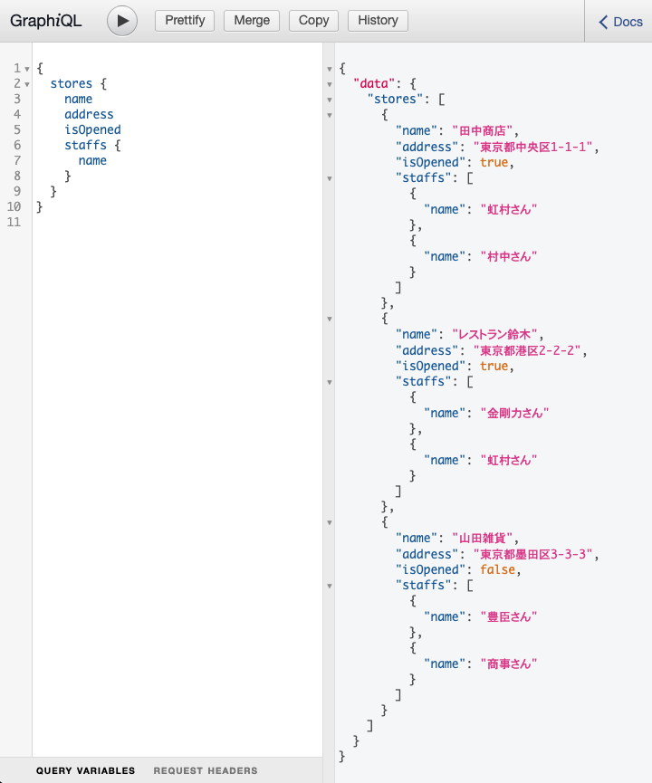

# 概要

[graphene-django](https://docs.graphene-python.org/projects/django/en/latest/)の調査のためのサンプル

## 実行結果



## command

```sh
docker-compose build
docker-compose up -d
docker-compose down

docker-compose run --rm django python manage.py makemigrations
docker-compose run --rm django python manage.py migrate
docker-compose run --rm django python manage.py dbshell
```

## import test data

```sh
docker-compose run --rm django python manage.py shell

from django_graphene.models import *
import random

staffs = ['鈴木さん', '宮崎さん', '村中さん', '虹村さん', '豊臣さん', '金剛力さん', '忍山さん', '商事さん']

stores = [
    { 'name': '田中商店', 'address': '東京都中央区1-1-1', 'is_opened': True },
    { 'name': 'レストラン鈴木', 'address': '東京都港区2-2-2', 'is_opened': True },
    { 'name': '山田雑貨', 'address': '東京都墨田区3-3-3', 'is_opened': False },
]

for store in stores:
    store = Store.objects.create(**store)

    for staff in random.sample(staffs, 2):
        Staff.objects.create(store=store, name=staff)
```
